# AWS Three-Tier Architecture Deployment

A production-style AWS infrastructure project built using VPC, public/private subnets, Application Load Balancer, Auto Scaling Group, Amazon RDS MySQL, CloudWatch, IAM, and S3.

This project demonstrates how a scalable and secure three-tier application architecture can be deployed on AWS following industry best practices for networking, availability, security, and monitoring.

---

## Project Overview

In this project, I designed and deployed a complete three-tier architecture from scratch on AWS.

The infrastructure separates resources into different layers:

* **Presentation Layer** → Application Load Balancer (ALB)
* **Application Layer** → EC2 Instances managed by Auto Scaling Group
* **Database Layer** → Amazon RDS MySQL

The architecture uses public and private subnets across multiple Availability Zones to improve security and availability.

---

## Architecture Diagram

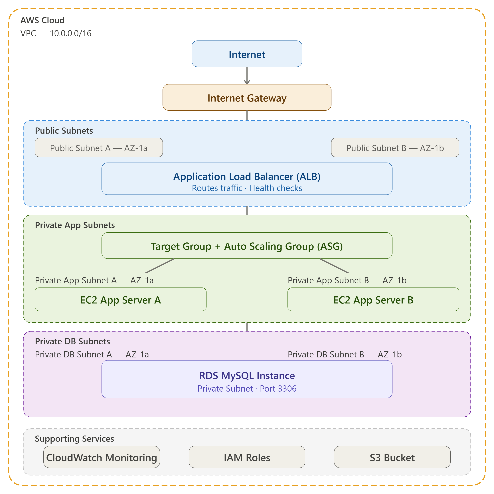

---

## Request Flow

```text
User
 ↓
Internet
 ↓
Internet Gateway
 ↓
Application Load Balancer
 ↓
Target Group
 ↓
Auto Scaling Group
 ↓
EC2 Application Servers
 ↓
Amazon RDS MySQL
```

---

## AWS Services Implemented

### Networking

* VPC (10.0.0.0/16)
* Public Subnets
* Private Application Subnets
* Private Database Subnets
* Internet Gateway
* NAT Gateway
* Route Tables

### Compute

* EC2 Instances
* Launch Template
* Auto Scaling Group

### Traffic Management

* Application Load Balancer
* Target Group

### Database

* Amazon RDS MySQL
* DB Subnet Group

### Monitoring & Security

* CloudWatch Alarm
* IAM Role
* Security Groups

### Storage

* Amazon S3

---

## Security Implementation

### ALB Security Group

Allows:

* HTTP (80)
* HTTPS (443)

From:

```text
0.0.0.0/0
```

### EC2 Security Group

Allows:

```text
HTTP (80)
```

Only from:

```text
ALB Security Group
```

### RDS Security Group

Allows:

```text
MySQL (3306)
```

Only from:

```text
EC2 Security Group
```

This ensures the database remains inaccessible from the internet.

---

## 📸 Project Screenshots

### VPC

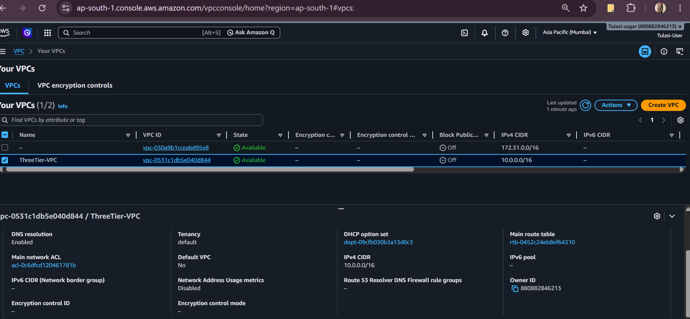

### Subnets

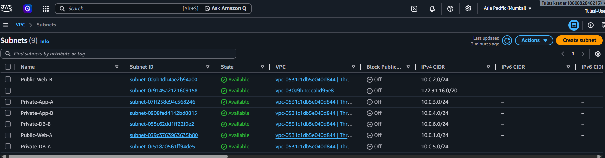

### Internet Gateway

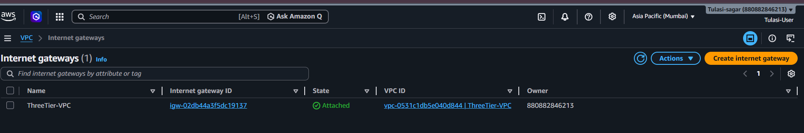

### NAT Gateway

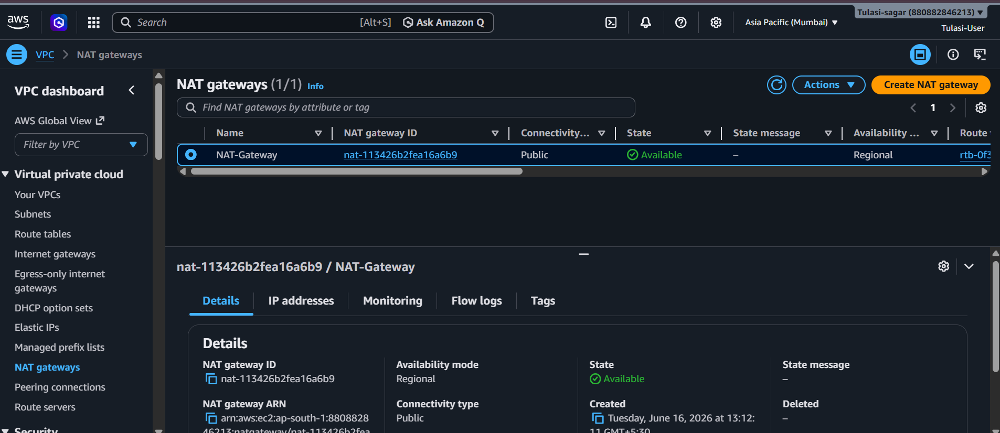

### Route Tables

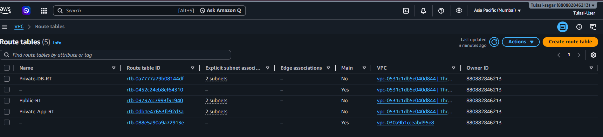

### Launch Template


### Target Group

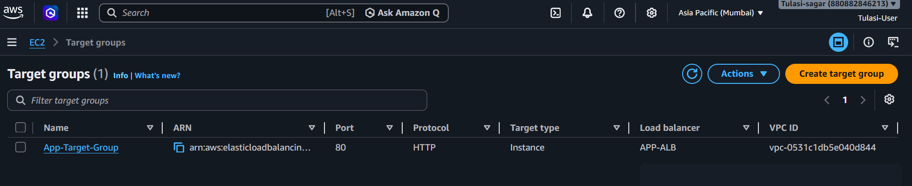

### Application Load Balancer

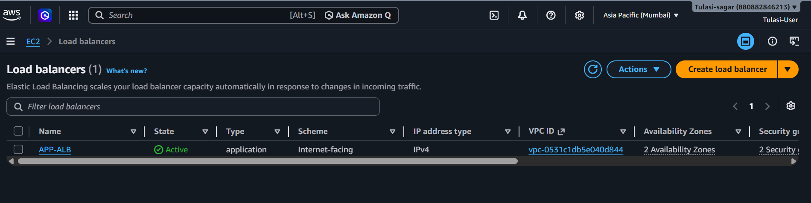

### Auto Scaling Group

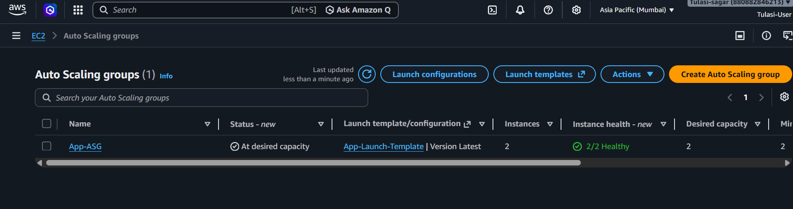

### EC2 Instances

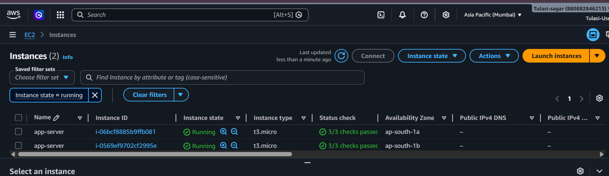

### Amazon RDS

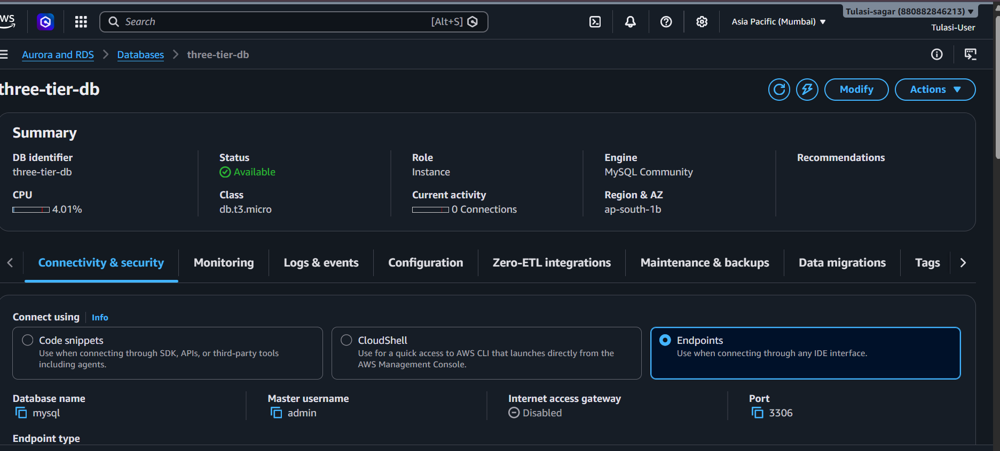

### CloudWatch Alarm

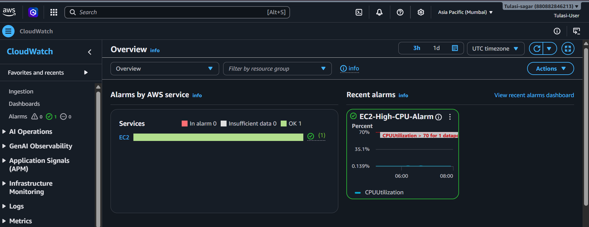

### Amazon S3

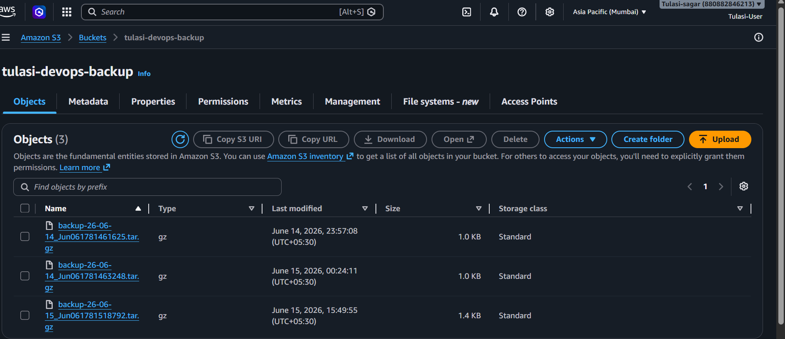

---

## Key Learnings

* Designed a secure three-tier AWS architecture.
* Understood public and private subnet isolation.
* Configured ALB and Target Groups for traffic distribution.
* Implemented Auto Scaling using Launch Templates.
* Learned how Security Groups control communication between layers.
* Deployed Amazon RDS inside private database subnets.
* Configured CloudWatch alarms for infrastructure monitoring.
* Applied IAM least-privilege access principles.
* Used S3 for object storage.

---

## Challenges Faced

| Challenge                         | Resolution                                                    |
| --------------------------------- | ------------------------------------------------------------- |
| Understanding subnet architecture | Practiced public/private subnet design and route associations |
| Learning ALB and ASG integration  | Connected Launch Template, Target Group and ASG               |
| Database isolation                | Restricted RDS access using Security Group references         |
| High availability design          | Distributed resources across multiple Availability Zones      |

---

## Outcome

Successfully deployed a production-style AWS environment demonstrating:

* High Availability
* Scalability
* Load Balancing
* Secure Network Design
* Monitoring & Alerting
* AWS Best Practices

---

## Author

**Tulasi Muntimadugu**

Aspiring DevOps Engineer

GitHub: https://github.com/tulasisagar

LinkedIn: https://linkedin.com/in/tulasi-sagar
